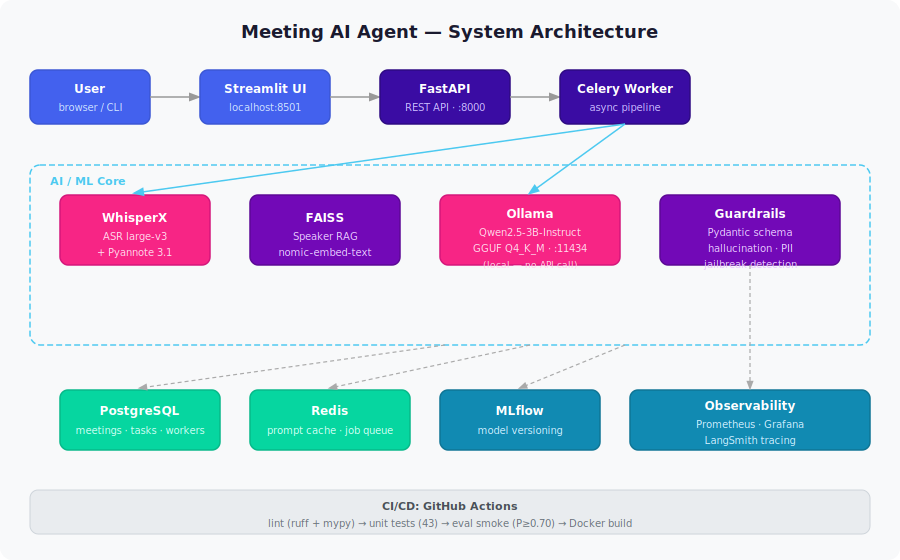

# System Overview

## Kiến trúc tổng quan

## Tech Stack

| Layer | Technology |
|-------|-----------|
| UI | Streamlit |
| API | FastAPI |
| Async Queue | Celery + Redis |
| ASR + Diarization | WhisperX + Pyannote |
| LLM | Qwen2.5-3B via Ollama |
| Vector Search | FAISS |
| Storage | PostgreSQL |
| Monitoring | Prometheus + Grafana + LangSmith |
| Training | Unsloth + MLflow |
| CI/CD | GitHub Actions + Docker |
