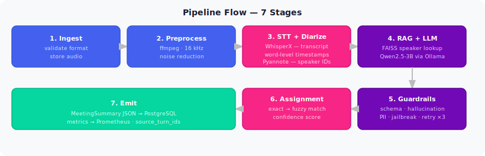

# Pipeline — End-to-End Flow

**Async execution:** Celery worker — user nhận `job_id` ngay, poll kết quả sau.

**Provenance:** Mỗi task output đều có `source_turn_ids` — biết chính xác câu nói nào trong transcript sinh ra task đó.
