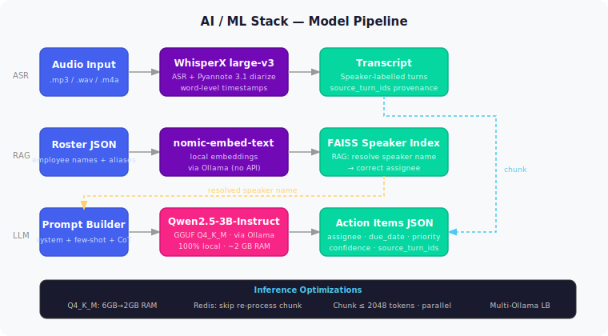

# AI/ML Stack

## Models sử dụng

## Tại sao chọn các model này?

| Model | Lý do |
|-------|-------|
| **WhisperX** | Word-level timestamps → biết task xuất phát từ câu nào; tích hợp sẵn diarization |
| **Pyannote 3.1** | Best open-source speaker diarization |
| **Qwen2.5-3B** | Instruction-following tốt; chạy hoàn toàn local; ~2GB RAM với Q4\_K\_M |
| **nomic-embed-text** | Local embeddings, không cần API |

## Inference Optimization

| Kỹ thuật | Hiệu quả |
|---------|---------|
| GGUF Q4_K_M quantization | RAM: 6GB → 2GB |
| Redis prompt cache | Skip re-process chunk đã xử lý |
| Chunking ≤ 2048 tokens | Xử lý song song, tránh overflow |
| Multi-Ollama load balancer | Round-robin / least-loaded routing |
