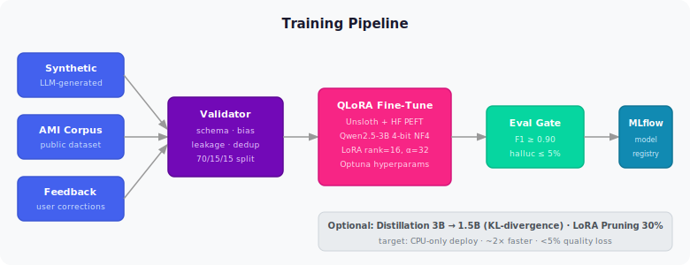

# Training Pipeline

## QLoRA Fine-Tuning

## Distillation & Pruning

| Kỹ thuật | Mục đích | Kết quả dự kiến |
|---------|---------|----------------|
| Knowledge Distillation (3B → 1.5B) | Chạy trên CPU-only | ~2× nhanh hơn, <5% quality loss |
| LoRA Magnitude Pruning (30%) | Giảm adapter size | File nhỏ hơn, deploy nhanh hơn |

## AutoML

Optuna tự tìm hyperparameters tốt nhất:
- LoRA rank: 8 / 16 / 32 / 64
- Learning rate: 1e-5 → 5e-4
- Batch size: 2 / 4 / 8
