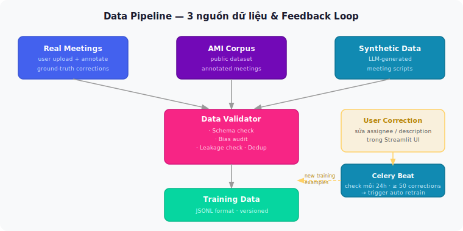

# Data Pipeline

## 3 nguồn dữ liệu & Feedback Loop

---

## Tại sao cần 3 nguồn?

| Nguồn | Mục đích |
|-------|---------|
| **Real Meetings** | Ground truth cao nhất — thực tế của doanh nghiệp |
| **AMI Corpus** | Public benchmark, đủ lớn để bootstrap |
| **Synthetic** | Tăng diversity, cover edge cases ít gặp |

> **Closed loop:** hệ thống tự cải thiện từ lỗi của chính nó qua Feedback Store.
