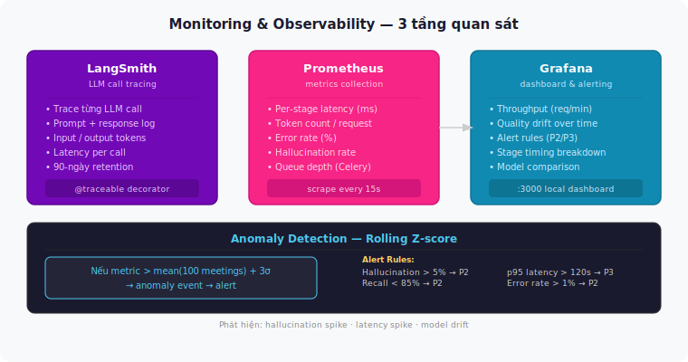

# Monitoring & Observability

## 3 tầng quan sát

---

## Alert Rules

| Condition | Severity |
|-----------|----------|
| Hallucination rate > 5% | P2 |
| Task extraction recall < 85% | P2 |
| p95 latency > 120s / 1h audio | P3 |
| Error rate > 1% | P2 |
