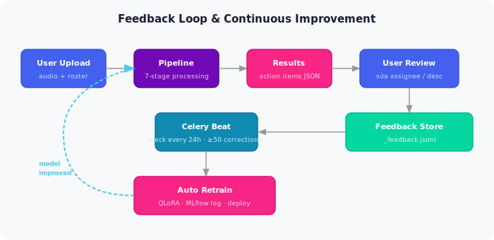

# Feedback Loop & Continuous Improvement

## Vòng lặp cải thiện liên tục



---

## Automated Retraining — Không cần can thiệp thủ công

```bash
# Kiểm tra có cần retrain không
python train/retrain.py --check
# → "Should retrain: False — only 12 corrections (need 50)"

# Force retrain thủ công
python train/retrain.py --force

# Hoặc qua API
curl -X POST "http://localhost:8000/admin/retrain?force=true"
```

**Celery Beat** tự động kiểm tra mỗi 24 giờ:
1. Export corrections → training examples
2. Validate dataset
3. Run `train/finetune.py`
4. Log model mới → MLflow
5. Canary deploy (10% traffic) → monitor 24h → full rollout

---

## Model Versioning với MLflow

Mỗi lần retrain = 1 experiment trong MLflow:
- Lưu adapter weights
- Đính kèm eval metrics (Precision, Recall, F1)
- So sánh với versions trước
- Auto-rollback nếu metrics xấu hơn

> **Không bao giờ mất model tốt cũ** — MLflow giữ lịch sử đầy đủ.
